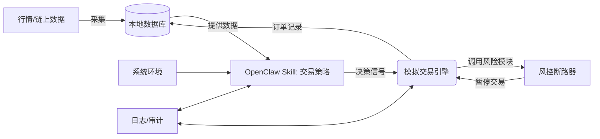

# 执行摘要

本方案在本地搭建 OpenClaw 模拟交易系统（纸上交易）全流程。首先明确假设与环境配置，包括交易所 API Key 和数据库等前提。接着构建数据采集管道，将行情、链上和社交情绪数据存储到本地数据库。然后在 OpenClaw 中定义交易 **Skill**（SKILL.md），并配置工具和长期记忆（如 LanceDB 或 pgvector），以实现策略生成与执行。方案提供示例代码、SQL 架构、回测命令、Webhook 调用示例，以及风控断路器、日志审计设计等内容。最后给出从模拟切换到实盘的条件与安全开关，以及常见故障排查命令，使读者能按步骤复制粘贴执行。

## 前提假设与环境准备

- **OpenClaw环境**：假设已在本地部署并启动 OpenClaw Gateway（可通过 `openclaw dashboard` 确认运行状态）。OpenClaw 版本**未指定**，建议最新版本。  
- **账户与密钥**：需要加密交易所账户（**未指定**具体交易所，可使用 Binance、Coinbase 等）及其 API Key/Secret。将 API 密钥安全存放，不写入代码。  
- **数据库**：使用本地 PostgreSQL 或 SQLite 存储数据和记忆；如果选 pgvector，需安装 Postgres 向量扩展【91†L338-L345】。数据库连接 URL 设置为环境变量 `DATABASE_URL`。  
- **项目结构**：示例目录如下，便于复制执行：  
  ```
  project/
  ├── Dockerfile            # 可选，用于容器化
  ├── requirements.txt      # Python 依赖
  ├── skills/
  │   └── strategy-skill.md # OpenClaw Skill 文件
  ├── memory_schema.sql     # 长期记忆表结构示例
  ├── data/                 # 市场与链上数据存储目录
  ├── src/
  │   ├── collector.py      # 数据采集脚本
  │   ├── backtest.py       # 回测脚本
  │   ├── simulator.py      # 模拟交易引擎
  │   └── risk.py           # 风控断路器逻辑
  └── .openclaw/            # OpenClaw 本地配置目录
  ```  

## 数据管道

- **行情与链上数据采集**：编写 Python 脚本（示例 `src/collector.py`）定时调用交易所行情 API 和链上 API，并保存至本地数据库。示例使用 Binance REST API：  
  ```python
  # src/collector.py
  import os, requests
  import psycopg2
  from datetime import datetime
  API_KEY = os.getenv("BINANCE_API_KEY")
  API_SECRET = os.getenv("BINANCE_API_SECRET")
  DB_URL = os.getenv("DATABASE_URL")
  conn = psycopg2.connect(DB_URL)
  cur = conn.cursor()
  res = requests.get("https://api.binance.com/api/v3/ticker/price", headers={"X-MBX-APIKEY": API_KEY})
  for coin in res.json():
      cur.execute("INSERT INTO market_data (symbol, price, ts) VALUES (%s,%s,%s)", 
                  (coin["symbol"], coin["price"], datetime.utcnow()))
  conn.commit()
  ```
  **命令示例**：`python src/collector.py` 运行并插入数据。可使用 `cron` 定期执行，例如 `*/5 * * * * /usr/bin/python /path/src/collector.py`。

- **数据存储**：创建表结构，如 PostgreSQL 示例：  
  ```sql
  -- memory_schema.sql
  CREATE TABLE market_data (
    id SERIAL PRIMARY KEY,
    symbol TEXT NOT NULL,
    price DECIMAL NOT NULL,
    ts TIMESTAMP NOT NULL
  );
  CREATE TABLE chain_data (
    id SERIAL PRIMARY KEY,
    chain_event JSONB,
    ts TIMESTAMP NOT NULL
  );
  CREATE TABLE sentiment (
    id SERIAL PRIMARY KEY,
    source TEXT,
    score REAL,
    ts TIMESTAMP NOT NULL
  );
  ```
  根据需要扩展字段和索引。例如为 `market_data.symbol` 建索引以加速查询。

- **数据清洗与标签**：采集后可预处理数据，如填充缺失、计算指标（MA、RSI）等。可以在 `collector.py` 中或另写脚本处理，并存入新表或更新原表。示例：`python src/compute_indicators.py --input market_data --output features`。

## Skill 开发与工具配置

- **Skill 文件示例**：在 `skills/strategy-skill.md` 编写交易技能。以下示例描述简单均值回归策略：  
  ```markdown
  ---
  name: mean_reversion
  description: 基于均值回归的加密货币交易策略
  version: 1.0.0
  author: 您的名字
  tags: [crypto, trading, mean-reversion]
  triggers: ["均值回归", "价格回归"]
  metadata:
    openclaw:
      requires: []
      tools: ["code_execution", "http_request"]
  inputSchema:
    type: object
    properties:
      recent_prices:
        type: array
        items: { type: number }
      mean_threshold:
        type: number
  outputSchema:
    type: object
    properties:
      action:
        type: string
      price:
        type: number
  ---
  
  ## 交易策略说明
  对输入的最近价格数组计算均值和标准差。如果当前价格高于均值加阈值，则发出卖出信号；低于均值减阈值发出买入信号；否则观望。  
  示例：设定 `mean_threshold = 2 * stddev`。
  ```
  更新技能后，提交版本：`git add skills/strategy-skill.md && git commit -m "Add mean-reversion strategy"`。

- **工具（Tools）配置**：技能通过 `metadata.openclaw.tools` 引入工具【87†L115-L123】。如上例引入 `code_execution`（运行本地脚本）和 `http_request`。OpenClaw 将这类工具映射为可调用函数。确保 OpenClaw 配置中已启用相关插件。

- **长期记忆设计**：可选用 LanceDB 或 pgvector 存储长期记忆【89†L76-L84】【91†L338-L345】。例如使用 LanceDB 插件：在 OpenClaw 配置中启用 `memory-lancedb` 插件，并设定嵌入模型。PGVector 方案则需在 Postgres 中建立向量列：  
  ```sql
  -- memory_schema.sql (续)
  CREATE EXTENSION IF NOT EXISTS vector;
  CREATE TABLE openclaw_memory (
    id SERIAL PRIMARY KEY,
    content TEXT,
    embedding vector(512),
    ts TIMESTAMP NOT NULL
  );
  ```
  训练数据与会话要保存的记忆可插入此表。

- **记忆 Compaction**：OpenClaw 支持自动摘要（称为 “dream” 或 “compaction”）。可设置如开启 `memory_dream`，或定期调用 `openclaw memory_summarize`。简易方案：使用 QMD 本地引擎【107†L125-L133】将旧对话合并成简短句段，避免记忆超载。例如在配置中添加：  
  ```json
  {
    "memory": {
      "backend": "qmd"
    }
  }
  ```  
  启用后，OpenClaw 会自动索引会话历史【107†L125-L133】，无需额外操作。

- **Webhook 与 API 调用**：可配置 OpenClaw Webhook 接受模拟下单请求。例如，以下为 OpenClaw 配置 `hooks` 部分，使其响应 `/hooks/place_order` 路径：  
  ```jsonc
  {
    "hooks": {
      "enabled": true,
      "path": "/hooks/place_order",
      "token": "your-shared-secret"
    }
  }
  ```  
  外部模拟交易系统可通过 `curl` 发起请求：  
  ```bash
  curl -X POST http://localhost:10000/hooks/place_order \
       -H "Authorization: Bearer your-shared-secret" \
       -H "Content-Type: application/json" \
       -d '{"symbol":"BTCUSDT","side":"BUY","quantity":0.1}'
  ```  
  OpenClaw 将此请求转为代理运行，触发下单技能。此配置示例参考【106†L182-L186】。

## 回测

- **回测环境**：使用 Python 回测框架，如 Backtrader。编写脚本 `src/backtest.py`，参数指向策略模型和历史数据。示例调用：  
  ```bash
  python src/backtest.py \
    --data data/BTCUSDT_1h.csv \
    --strategy skills/strategy-skill.md \
    --start 2020-01-01 --end 2021-01-01 \
    --output reports/backtest_results.csv
  ```  
- **交易成本模拟**：在回测中设置固定手续费和滑点。例如在策略代码中设置 `broker.setcommission(commission=0.001)`（千分之一）。滑点可用触发价或比例模拟。  
- **蒙特卡洛测试**：随机重采样历史价格进行多轮回测。示例 Python：  
  ```python
  import random
  for i in range(100):
      sample = random.sample(prices, len(prices))
      run_backtest(sample)
  ```  
  统计每轮收益和回撤，评估策略鲁棒性（示例输出可绘制生存率曲线）。  
- **结果分析**：将回测结果存为 CSV，然后可在 Jupyter 或 Excel 中查看关键指标（盈亏曲线、夏普率、最大回撤等）。

## 模拟交易

- **启动模拟引擎**：实现 `src/simulator.py`，循环获取交易信号并执行。可直接调用 OpenClaw Skill 生成信号，例如：  
  ```python
  from openclaw import OpenClaw
  oc = OpenClaw()
  signal = oc.agent.run_skill("mean_reversion", {
      "recent_prices": latest_prices, "mean_threshold": 2*std_dev
  })
  if signal["action"] == "BUY":
      print("模拟买入", signal["price"])
  elif signal["action"] == "SELL":
      print("模拟卖出", signal["price"])
  ```  
- **虚拟账户跟踪**：在模拟模式下，跟踪账户余额和持仓，无实际交易。比如每次生成信号时，记录到数据库 `simulator.log`：  
  ```bash
  # src/simulator.py 输出示例
  模拟买入 50000.00
  模拟卖出 51000.00
  ```  
- **Webhook 触发交易**：可以通过外部命令触发模拟下单。结合前文 Webhook 配置，使用 `curl` 模拟交易所请求。保证下单记录写入 `orders` 表：  
  ```bash
  curl -X POST http://localhost:10000/hooks/place_order \
       -H "Authorization: Bearer your-shared-secret" \
       -d '{"symbol":"BTCUSDT","side":"BUY","quantity":0.1}'
  ```

## 监控与风控

- **日志与审计**：将关键操作记录到日志文件（或数据库）。如采用 Python 的 `logging` 模块：  
  ```python
  import logging
  logging.basicConfig(filename='logs/app.log', level=logging.INFO)
  logging.info("Executed BUY order for 0.1 BTC at 50000")
  ```  
  审计表可记录所有信号和订单流水，用于日后回顾。  
- **风控断路器**：实现自动风险控制。例如设定单笔最大风险和日亏损阈值，超过则暂停交易。示例 `src/risk.py`：  
  ```python
  MAX_DAILY_LOSS = 1000.0
  if account.daily_loss > MAX_DAILY_LOSS:
      logging.warning("触发日亏损断路，停止交易")
      break
  ```  
  可周期调用风控模块，或将其并入模拟引擎决策逻辑中。  
- **监控告警**：异常情况时发送邮件或消息通知。可在触发断路时调用 Slack/Webhook API 或系统邮件。例如 `slack_notify("风险断路已触发")`。

## 切换与运维

- **模拟与实盘开关**：使用配置变量区分模式，如环境变量 `MODE=paper` 或 `live`。根据模式决定是否调用真实交易 API。开关初期应手动控制，并逐步放大实盘比例（“金字塔放量”）。  
- **切换条件**：定义策略绩效标准，如多个月净利稳定且最大回撤低于阈值，然后可考虑实盘。此过程应配合人工复核。  
- **自动化流程**：可编写脚本 `src/live_switch.sh`，在满足条件时修改配置：  
  ```bash
  # 切换到实盘模式
  export MODE=live
  echo "模式已切换为实盘" >> logs/app.log
  ```  
- **常见故障排查**：  
  - 数据获取失败：检查 API 令牌是否过期，脚本是否报错（检查 `logs/app.log`）。  
  - 无信号生成：确保 Skill 文件已加载（查看 `.openclaw` 目录），验证输入参数格式正确。  
  - 记忆丢失：确认数据库表是否存在并有数据，检查 OpenClaw 插件配置。  
  - 订单错误：若模拟订单与预期不符，检查算法逻辑和计算方式，并查看日志中具体计算输出。  

## 架构图



## 关键资源表

- **Secrets 列表**：  
  | 名称               | 用途                    | 示例/说明        |
  |--------------------|-------------------------|-----------------|
  | BINANCE_API_KEY    | 交易所 API Key           | 存于环境变量    |
  | BINANCE_API_SECRET | 交易所 API Secret        | 存于环境变量    |
  | DATABASE_URL       | 数据库连接字符串         | 存于环境变量    |
  | SHARED_WEBHOOK_TOKEN | Webhook 访问令牌        | 自行生成并存储  |

- **资源需求**：  
  - 本地 PostgreSQL 或 SQLite；可选安装 pgvector 扩展。【91†L338-L345】  
  - Python 运行环境，安装 `requests`、`psycopg2-binary`、`backtrader` 等库。  
  - Node.js 环境（已安装 OpenClaw CLI）。  

## 优先参考来源

- OpenClaw 官方文档：【87†L115-L123】【89†L76-L84】【107†L125-L133】等；  
- Webhooks 配置示例：【106†L182-L186】；  
- 回测与交易策略常见实践（行业公开资料）。