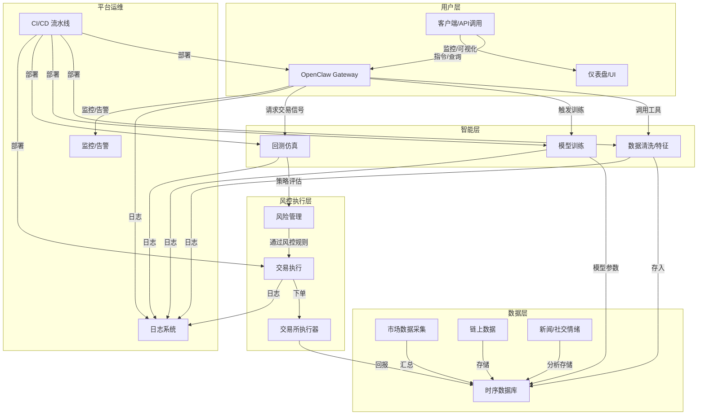

# 执行摘要

本方案提出在 Render 平台上构建一个模块化的加密货币投资系统，核心采用 OpenClaw 作为智能代理引擎，实现自动数据获取、策略学习、模拟交易和实盘执行。系统分为数据采集、模型训练、回测仿真、风险管理和交易执行等组件，并配以 CI/CD 流水线和监控预警。通过整合交易所 API、链上数据、新闻社交情绪等多源信息，并利用行为克隆、强化学习、元学习等技术模仿资深交易员策略，系统将在达到严格的模拟考核指标后自动切换至实盘交易，同时内置风控限额和合规模块保障安全。方案涵盖服务架构图、数据流程图、关键工具和库对比表、示例配置片段、监控仪表板草图及风险矩阵，以确保实现高度可扩展、高可用、安全合规的落地部署。

## 项目目标与范围

- **目标**：构建一个可模拟且可实盘切换的自动化加密交易平台。系统在模拟模式下收集市场数据、学习策略、运行回测和模拟交易；当达到稳定收益指标（如连续多月正收益、最大回撤控制在设定阈值等）时，自动切换至实盘交易。实盘切换条件可通过回测蒙特卡洛压力测试等严格考核【69†L1-L4】来判定。  
- **风险容忍度**：可配置的最大回撤和仓位限额。默认设置严格监控总资金的最大亏损（如 5%）和单仓位占比（如 1-2%），触发断路器时自动平仓或暂停交易。  
- **支持资产种类**：主要涵盖主流加密资产（如BTC、ETH）、稳定币及用户自定义代币，支持现货、杠杆和合约（期货、期权等）交易【16†L16-L24】。交易对可配置，例如币安等交易所提供 300+ 种资产的现货、杠杆、期货和期权市场【16†L16-L24】。  
- **交易所接口**：集成主流交易所 API（如 Binance、Coinbase、OKX、火币、Bitfinex 等），采用统一封装（可使用 CCXT）提供 REST/WebSocket 接口支持。接口包括行情数据、交易账户、下单、查询等功能。项目将针对不同交易所封装适配层，提供限价、市价、算法单（如 TWAP、VWAP）等下单功能，并支持多个接口同时下单以实现最佳路由。

## 系统架构

系统采用微服务架构，主要模块包括：**数据采集服务**（定时从交易所、链上和新闻源获取数据）、**OpenClaw 智能引擎**（加载“技能”并调用工具分析数据、生成交易信号）、**模型训练服务**（训练/微调 AI 策略）、**回测仿真服务**（离线验证策略）和**交易执行服务**。各模块运行在 Render 提供的服务上，包括 Web Services（对外 API/UI）、Private Services（内部逻辑）、Background Workers（持续任务）和 Cron Jobs（定时任务）。数据流与控制流程如下图所示：  

- **部署环境**：所有服务容器化，通过 Render 支持的 Docker 部署。数据存储使用 Render 提供的 PostgreSQL（开启高可用和读副本方案【67†L99-L103】【63†L330-L339】）和 Key-Value（兼容 Redis【67†L78-L86】）服务。长期记忆可使用带 pgvector 的 Postgres 或外部向量数据库。  
- **可扩展性**：应用实例可设置水平自动扩展（Pro 版支持）或手动扩展，Redis 用于共享会话或缓存以支持多实例并发。各服务无状态设计，允许按需横向扩展并配合负载均衡。私有网络（Private Networking）和多区域部署（Regions）可用于隔离敏感流量【67†L99-L103】。  
- **高可用**：关键服务（如交易执行、数据库）部署双活或读写分离。Render Postgres Pro 版支持自动故障切换 HA【63†L332-L339】【77†L173-L179】。前端服务配置健康检查（Health Checks）和重启策略，确保单实例故障自动重启。日志和监控平台全天采集指标（自定义 Render 的 Dashboard Metrics【77†L133-L142】和 Syslog）及健康状态。

## OpenClaw 集成细节

- **技能管理**：OpenClaw 的**技能（Skills）**通过 Markdown 文件定义，注入到系统提示中指导代理行为【36†L125-L134】。我们将为交易任务编写专门的 Skill，例如市场分析、信号生成、下单逻辑等。技能采用版本控制（Git）管理，每次策略更新生成新版本以备回溯比对。  
- **工具使用**：OpenClaw 内置丰富工具（如 `exec`、`code_execution`）可执行 Python 代码、调用 REST API、浏览器抓取等【36†L158-L167】。例如，可用 Python 脚本工具实时查询交易所行情或链上数据，也可调用自定义插件执行回测。技能将明确何时使用哪些工具，例如获取报价、计算指标、生成买卖建议。  
- **长期记忆**：为避免“失忆”，OpenClaw 会将重要信息持久化为会话外文件，并在上下文接近极限时自动摘要历史消息【34†L109-L117】。系统可配置编译（compaction）策略，当上下文长度接近模型窗口时，OpenClaw 将旧消息归纳成要点并存入内存文件，确保关键知识不丢失【34†L109-L117】。还可扩展注册自定义内存插件，或使用 Render Key-Value（Redis）存储持久对话和代理决策历史。  
- **模型训练/微调**：OpenClaw 可集成 ChatGPT、Claude、local LLM 等多种模型。底层可针对财经语料或交易日志微调模型（比如使用 llama2 等生成式模型定制财经助手），或直接使用现成大模型。训练流程可由辅助脚本（在训练服务中运行）完成，通过历史数据和专家示例强化模型能力。监督信号可来自历史交易回放、专业分析报告、市场指标等，用于微调奖励模型或行为克隆监督。  
- **学习维持**：OpenClaw 会定期通过 Cron 任务触发技能更新和模型再训练（如每天复盘），保持策略和知识与市场变化同步。技能文件本身也可周期审查和更新，例如通过评价指标自动提醒优化。

## 数据管道

- **数据来源**：包括**市场行情**（交易所 REST API/WebSocket 如 Binance、Coinbase）、**链上数据**（区块浏览器或 API，如 Etherscan、Covalent）、**新闻/社交情绪**（新闻聚合器、Twitter/X API、Reddit API）以及**专家交易记录**（如 CopyTrading 平台历史数据）。例如，可使用 Alpha Vantage 提供的区块链新闻情绪 API 和 CoinGecko 的市场数据接口进行信息采集【40†L302-L310】。  
- **采集工具**：推荐使用爬虫框架（Scrapy）或调度框架（Prefect、Airflow）定时拉取或推送（Webhook）数据。可以参考开源数据管道项目，例如利用 Prefect 编排每日行情和情绪数据收集的例子【40†L302-L310】。  
- **清洗与预处理**：对接收到的数据进行去重、缺失值填充、格式转换。股票 K 线、订单流等时序数据标准化后存储。可自动挖掘特征（如移动平均、动量指标）并选择重要特征【28†L163-L172】。  
- **存储设计**：**时序数据库**：考虑使用时序扩展的 Postgres（Timescale）或开源 TSDB（如 InfluxDB）存储行情与链上时间序列数据，支持高速写入和历史回溯。**长期记忆库**：存储策略快照、过往交易日志、OpenClaw 记忆条目，可使用 Postgres 的 pgvector 扩展或专用向量数据库（如 Weaviate）。**备份与保全**：启用 Postgres 的自动备份与时间点恢复 (PITR)【63†L330-L339】；将原始数据快照保存至对象存储，如 AWS S3，以便任何策略复盘时完整追溯。  
- **数据完整性**：所有关键数据表和日志开启审计，记录变更时间和来源。对链上数据应验证事件签名，对行情数据可交叉校验多个来源。  
- **示例工具**：可用 Python 库如 `ccxt` 获取行情、`web3.py` 访问链上事件，`tweepy` 获取推特情绪。使用专用行情库（如 PyCryptodome）处理加密等特殊需求。消息队列（Redis Pub/Sub）可在各服务间传递实时信号。  

## 策略学习与复制

- **特征工程**：从多源数据提取技术指标（EMA、RSI、MACD 等）、交易深度指标（买卖盘结构、成交量加权指标）、链上指标（网络活动、巨鲸地址交易）以及情绪指标（新闻情感分数、社交热度）等。利用自动化特征工程（如 TradeMaster 的 pipeline）也可进行特征选择和嵌入【28†L163-L172】。  
- **行为克隆**：采用专家交易日志（如顶尖交易员的历史下单记录或模拟信号）作为监督标签，训练模型直接模仿其决策。可利用序列建模（LSTM、自注意力网络）捕捉时序策略，也可参考「投资者模仿器（Investor-Imitator）」等算法进行克隆【28†L166-L174】。  
- **强化学习**：将交易视为序列决策过程，使用深度强化学习算法学习最优策略。现有研究和开源平台（如 TradeMaster）实现了多种 RL 交易算法（PPO、DQN、DDPG、SAC 等）【28†L166-L174】，可直接借鉴。奖励函数一般基于收益率、夏普比率等指标设定，并加入风险惩罚。  
- **因果推断**：在策略开发阶段，可利用因果分析工具评估外部事件（如政策、黑天鹅）对资产价格的影响，以避免模型盲目归因。比如使用双重差分分析或工具变量评估新闻发布对价格的因果效应，将这种因果知识融入策略解释。此类技术偏研究性，但在风控和策略验证中具有参考意义。  
- **元学习**：采用元学习方法让模型快速适应市场变化。研究表明元学习可提升策略在不同市场环境下的鲁棒性【70†L95-L103】。例如，可维护一组“候选策略池”（多种历史最佳策略），并用元学习调整它们的组合权重，使投资组合能够迅速响应新的市场特征【70†L95-L103】。  
- **策略相似度与可解释性**：对比不同策略，可使用特征重要性（SHAP 值）或政策梯度分析衡量两策略决策的一致性。策略相似度可用交易信号序列的统计相关性或 KL 散度评估。可解释性方面，借鉴可解释增强 RL（Explainable RL）技术，对模型的决策逻辑进行可视化分析，将交易信号和关键驱动特征反馈给用户。

## 回测与模拟交易平台

- **回测框架**：常用 Python 开源框架包括事件驱动的 Backtrader、Zipline 以及向量化的 VectorBT 等。Backtrader 提供丰富功能：支持多资产多频率、技术指标、佣金/滑点模拟、参数优化等【75†L121-L124】；VectorBT 则利用向量化操作速度极快，适合大规模数据回测【75†L121-L124】。可以根据需求选择或组合（例如使用向量化库构建快速统计分析，用 Backtrader 还原真实订单簿过程）。  
- **成本建模**：模拟时需考虑交易成本，包括手续费（固定费率和阶梯费率）、滑点（依市深度模拟）和冲击成本。可以基于历史订单簿数据拟合滑点模型（比如线性或对数模型），并在回测中模拟撮合延迟。  
- **蒙特卡洛压力测试**：对策略进行随机重采样测试。通过对价格序列加入随机扰动或替换序列段，生成数千个样本路径，验证策略在极端情况下的表现（包括最差情景收益、最大回撤分布等）。  
- **并行加速**：利用 Python 的多进程或分布式计算并行回测不同参数集和策略组合。云端可在 Render 中启动临时任务（One-off jobs）并行运行多组回测，或利用 Render 的后台 Worker 并行化回测任务。  
- **绩效指标**：需统计包括总收益、年化收益率、夏普率、最大回撤、胜率、盈亏比等常用指标，并可附加绝对风险（VaR）和相对风格（Alpha/Beta）指标。综合评价多维度表现，从收益、风险、多样性和可解释性评估策略效果。  
- **可视化**：回测报告应包含权益曲线、风险指标表格、指标与价格的叠加图等。可参考 TradeMaster 提供的雷达图和时序图样式【28†L169-L177】。  
- **对比工具表**：下表列举常用回测平台特点供参考：

| 框架      | 核心类型   | 速度         | 费用模型 | 扩展性    | 特点                                       |
| --------- | -------- | -------- | ------- | -------- | ---------------------------------------- |
| Backtrader【75†L116-L124】 | 事件驱动   | 中等        | 支持多样   | 高       | 支持多订单类型、委托类型、策略优化，生态成熟 |
| Zipline   | 事件驱动   | 中等        | 支持       | 高       | 与Quantopian兼容（兼容性需注意版本），社区维护 |
| VectorBT【75†L121-L124】  | 向量化    | 非常快      | 原生数组操作 | 中等     | 支持大数据快速回测，可扩展自定义指标         |
| vn.py     | 事件驱动/平台 | 高（C++底层） | 支持       | 非常高   | 国内流行，集成CTP实盘接口及期权，功能全面     |
| **备注**  |          |          |         |          | 性能评价中等为事件驱动仿真速度，向量化为批量计算 |

## 风险管理与合规

- **风险规则与头寸限制**：定义最大持仓比例、最大杠杆倍数和最大单日亏损。例如单次下单不超过账户净值 2%，总持仓不超过账户净值 10%；触发单日亏损超过 3% 则暂停交易。监控指标包括实时 VaR、潜在未实现亏损等。  
- **自动断路器**：引入自动风控机制，如资金或持仓达到警戒线，触发平仓或暂停信号。可实现分级断路器：例如 1 级警告，策略减少规模；2 级强制平仓；3 级系统停盘。系统应记录断路事件并人工复核。  
- **合规与 KYC/AML**：由于涉及实盘交易，必须遵守金融监管。若使用法币或需履行 KYC，平台应要求交易所账户完成实名认证；对大额交易实施 AML 合规检查。系统需记录所有交易日志、账户流水和用户操作，以备审计。Render 平台提供审计日志功能（Pro 版可启用组织审计日志【63†L197-L204】），确保部署和访问都被记录。  
- **审计日志**：系统应记录决策过程与交易执行的日志：包括每次模型信号、下单指令和实际成交详情。数据库开启审计或使用外部日志（如 Datadog）集中存储日志，并定期检查一致性。Render 的工作区审计日志功能可跟踪部署变更和操作【63†L197-L204】。

## 交易执行层

- **API 适配器**：对接各交易所原生 API，可使用 Python 库（如 `ccxt`）统一接口，也可直接使用交易所官方 SDK。适配器负责下单、查询订单状态和持仓、处理撤单等，支持限价、市价、止损等多种委托。  
- **订单路由**：若多交易所支持相同资产，可实现智能路由。如查询各所最优买卖价或深度，以最低滑点成本分配订单。也可配置同时拆单于多所，提高成交概率。  
- **延迟优化**：尽量使用 WebSocket 推送行情和订单状态减少轮询延迟。服务器可选择 Render 最接近目标交易所服务器的区域部署；如需极低延迟执行，可在本地服务器部署辅助执行器（使用 Webhook 与云端通信）。尽管 Render 无法使用 GPU，但可借助低延迟本地网关。  
- **故障恢复**：实现幂等逻辑：如网络抖动重发委托前保持原委托 ID，避免重复下单。监控接口错误和拒单（如流量限制），自动重试或切换备用凭证。交易所返单不稳定时，对冲和补偿策略（如自动调整余额断差）。系统需保证在异常场景（连接中断、API 失败）下有清晰的回滚流程。  

## 部署、CI/CD 与监控

- **部署步骤**：使用 Docker 构建各服务镜像。在 Git 仓库配置 Render 服务（Web、Private、Worker、Cron 等），编写 `render.yaml` Blueprint 定义基础设施（代码示例见下）。连接 GitHub/GitLab，通过自动构建部署（Auto-Deploy），每次合并触发构建【77†L202-L209】。配置环境变量和私密凭据（如 API 密钥）在 Render Secrets 中管理。  
- **CI/CD**：集成 Git 平台的 CI（GitHub Actions/GitLab CI），Render 可配置在 CI 通过后再自动部署【77†L202-L209】【53†L220-L229】。利用构建过滤（Build Filters）和跳过短语（[skip render]）精细控制部署触发时机。失败情况下自动回滚到上一个稳定版本，确保系统可用性。  
- **自动化测试**：编写单元测试和集成测试检查数据管道、交易逻辑和 API 接口，借助 CI 在每次提交时运行。对于交易策略，可在 CI/CD 流水线上增加小规模回测，验证无误后方可部署新版本。  
- **监控与告警**：启用 Render 的健康检查机制（Health Checks）对关键服务进行探活【77†L133-L142】。通过 Webhook 配置（Render 支持 Slack/Email 通知）将指标或错误告警推送至团队；或者使用 OpenTelemetry 将自定义指标输出到 Prometheus/Grafana。系统监控指标包括：请求延时、服务可用率、未完成订单数、风险指标（如当前最大回撤）、模型性能等。Render Dashboard 内置指标和日志功能【77†L133-L142】可实现可视化。  
- **日志记录**：所有服务标准输出日志发往 Render 日志系统；可结合外部日志管理（如 Datadog、Syslog）进行长期留存和查询。关键交易和策略决策记录应永久保存。

## 安全与隐私

- **密钥管理**：所有私钥和 API 密钥存储于 Render 的 Secrets 管理，不暴露在代码或日志中。服务间通信通过 HTTPS/TLS 加密，数据库加密传输。  
- **访问控制**：使用 Render 工作区角色与团队管理，启用高级 RBAC（Pro 版）和 SAML 单点登录【63†L197-L204】限制访问权限。数据库授予最小权限账号访问，仅允许必要查询/写入。  
- **对抗防护**：对于 OpenAI 等模型使用限制，以防止 Prompt Injection 或对抗性输入；对交易信号进行异常检测，避免模型输入恶意数据导致非预期交易。对外服务（如 Webhook）使用签名验证。  
- **数据保密**：敏感数据（用户凭证、交易细节）加密存储，日志中避免打印敏感信息。对外通信启用双因素验证或时限令牌，严格限制网络出站规则。Render 自带 DDoS 防护和合规支持【77†L171-L179】，保障部署安全。

## 成本估算与资源需求

- **计算资源**：开发和测试阶段可使用较低规格实例（如 Render Starter：0.5 CPU、$7/月【63†L298-L302】）。生产环境则建议至少 Standard（2GB RAM,1CPU,$25/月）以上，或更高规格视交易量而定【63†L298-L302】。若训练涉及大量计算，可考虑外部 GPU 资源（Render 本身不提供 GPU，可使用云供应商专用节点进行模型训练）。  
- **存储**：PostgreSQL 存储费用（Basic 1GB $19/月, Pro 4GB $55/月【63†L332-L339】）视数据量扩展；附加块存储 SSD $0.25/GB·月【63†L288-L295】。长期历史数据可存入外部冷存储。  
- **带宽与其他**：预算考虑 API 调用费和数据传输。Render 免费/Pro 版含少量流量，超额按量计费；监控数据传输可忽略不计。  
- **长期记忆存储**：若使用向量数据库，如 AWS S3 + Elasticsearch/Kendra，需额外预算；可先利用 Render Postgres pgvector 低成本方案。  
- **大致费用**：基础部署（1 Web,1 Worker,DB 4GB）约 $25+$55=$80/月 加少量 SSD 费用。规模扩大后按需增实例，一般单实例上限几百美元/月，具体视策略性能和规模而定。

## 路线图与里程碑

- **MVP 阶段（1-2 个月）**：完成基础数据采集与存储管道，初步的回测框架搭建（如用 Backtrader 做简单策略回测），并在 OpenClaw 中开发简单技能（如行情查询、基本策略）。部署在 Render，实现 CI/CD 自动化。  
- **1.0 版本（3-4 个月）**：引入更多数据源（链上、社交媒体），构建训练流水线（可基于强化学习或行为克隆训练简单模型）。完善模拟交易平台，集成风险控制模块（头寸限制、自动断路）。  
- **2.0 版本（6 个月）**：优化策略学习（结合元学习、因果推断），实现多策略池和动态权重分配。添加监控告警系统、审计日志、合规流程。准备实盘交易接口接入，初步部署小规模实盘测试。  
- **迭代计划**：每阶段结束进行验收，包括模拟考核和安全检查。后续迭代可增加量化策略市场、中英文支持、更多交易市场支持等。  

## 交付物格式示例

- **架构图与数据流图**：使用 Mermaid 语法绘制（如下示例），展示系统组件和信息流。  
- **关键对比表**：上表比较了常见回测框架的特点，可视项目需求选型；其他表格可列出常用工具/库（如 CCXT vs 各交易所 SDK），持续更新选择依据。  
- **配置片段与命令**：示例 Render 服务 `render.yaml` 片段、示例 Dockerfile、训练脚本和回测执行命令示例。  
- **监控仪表板草图**：可使用可视化工具（Grafana）绘制主监控面板，包括实时 PnL、风险指标、系统健康指标等。  
- **风险矩阵**：列出主要风险来源（市场波动、系统故障、合规问题）及对应缓解措施。

综上，本方案从目标划分、技术选型到实施细节和运营方案全面覆盖了项目需求，并结合相关文档与学术成果（如 TradeMaster 强化学习平台【28†L166-L174】、Meta-Learning 投资研究【70†L95-L103】等）提供可行的技术指导和实施蓝图。

**参考文献：** OpenClaw 官方文档【36†L125-L134】【34†L109-L117】、Render 部署文档【77†L202-L209】【63†L298-L302】、主流交易所 API 文档【16†L16-L24】及相关开源项目/论文【28†L166-L174】【70†L95-L103】【40†L302-L310】【75†L121-L124】等。

